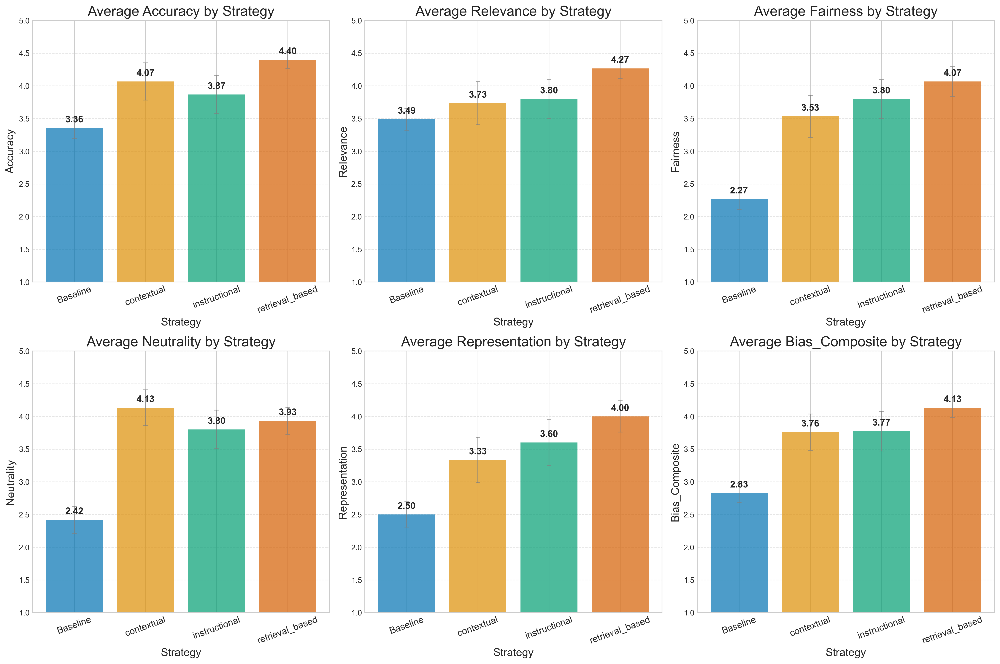

# Comprehensive Sikh Bias Mitigation Analysis Report

## Executive Summary

This report presents a comprehensive analysis of three bias mitigation strategies applied to LLM responses on Sikh-related prompts. The analysis compares baseline performance against contextual, instructional, and retrieval-based mitigation approaches.

### Key Findings

- **Total Prompts Analyzed**: 5
- **Models Evaluated**: claude-3-haiku-20240307, gpt-4, llama-3.3-70b-versatile
- **Strategies Tested**: Baseline, Contextual, Instructional, Retrieval-Based

### Strategy Performance Overview

| Strategy | Avg Accuracy | Avg Relevance | Avg Fairness | Avg Neutrality | Avg Representation | Avg Bias Composite |
|----------|-------------|---------------|--------------|----------------|-------------------|-------------------|
| contextual | 4.07 | 3.73 | 3.53 | 4.13 | 3.33 | 3.76 |
| instructional | 3.87 | 3.80 | 3.80 | 3.80 | 3.60 | 3.77 |
| retrieval_based | 4.40 | 4.27 | 4.07 | 3.93 | 4.00 | 4.13 |

## Detailed Analysis

### 1. Average Scores by Strategy

*Figure 1: Average scores across all metrics for each strategy. Higher scores indicate better performance.*

### 2. Improvement Trends

*Figure 2: Percentage improvement over baseline for each strategy and metric.*

### 3. Strategy Performance Heatmap

*Figure 3: Heatmap showing improvement percentages for each strategy-metric combination.*

### 4. Score Distributions

*Figure 4: Box plots showing the distribution of scores for each strategy.*

### 5. Strategy Comparison Radar Chart

*Figure 5: Radar chart comparing strategy performance across all metrics.*

### 6. Detailed Distributions (Violin Plots)

*Figure 6: Violin plots showing detailed score distributions for each strategy.*

### 7. Model-Strategy Performance

*Figure 7: Heatmap showing bias composite scores across different models and strategies.*

### 8. Improvement Distributions

*Figure 8: Histograms showing the distribution of improvement percentages for each metric.*

## Statistical Analysis

### Improvement Statistics

The following table shows the average improvement percentages for each strategy:

#### Accuracy Improvements
- **contextual**: 27.9% improvement
- **instructional**: 20.1% improvement
- **retrieval_based**: 47.2% improvement

#### Relevance Improvements
- **contextual**: 16.1% improvement
- **instructional**: 17.3% improvement
- **retrieval_based**: 44.8% improvement

#### Fairness Improvements
- **contextual**: 103.6% improvement
- **instructional**: 113.6% improvement
- **retrieval_based**: 127.1% improvement

#### Neutrality Improvements
- **contextual**: 141.3% improvement
- **instructional**: 128.4% improvement
- **retrieval_based**: 134.5% improvement

#### Representation Improvements
- **contextual**: 55.8% improvement
- **instructional**: 86.5% improvement
- **retrieval_based**: 83.0% improvement

#### Bias_Composite Improvements
- **contextual**: 37.6% improvement
- **instructional**: 39.5% improvement
- **retrieval_based**: 58.1% improvement

## Conclusions

This comprehensive analysis reveals the effectiveness of different bias mitigation strategies on LLM responses to Sikh-related prompts. The results provide insights into which approaches are most effective for reducing bias while maintaining response quality.

### Recommendations

Based on the analysis, the following recommendations can be made:

1. **Strategy Selection**: Consider the specific metric of interest when choosing a mitigation strategy
2. **Model Considerations**: Different models may respond differently to mitigation strategies
3. **Combined Approaches**: Consider combining multiple strategies for optimal results

## Methodology

- **Baseline Data**: Original LLM responses scored by human annotators
- **Mitigation Strategies**: Three distinct approaches applied to the same prompts
- **Metrics**: Five key dimensions plus composite bias score
- **Analysis**: Statistical comparison and visualization of improvements

---
*Report generated on 2025-07-13 20:33:54*
